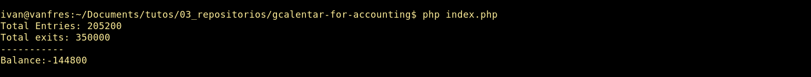

# gcalendar-for-accounting
Inicialmente este paquete funciona con Google Calendar

### Uso
1. Registro via web con cuenta de Google
2. Pantalla para completar los 2 calendarios de entrada y salida
3. Pantalla de configuraciones de los calendarios

### Exmaples

### Doing
1. Almacenado en DB de los eventos
2. Configuracion de Schemas/tablas
3. Comparar si el evento/transaccion ya fue agregado con anterioridad o si el valor 
4. Almacenar en cache eventos y datos del usuario

### Todo
1. Construir API basica
2. Validar, que solo exista un valor que sea entendido como monto, evitar duplicacion en la misma oracion
3. Obtener la moneda
4. Multimomeda
5. Asignar integrantes, receptores o emisores de la/s transacciones
6. Parametros mensuales en la configuración (Poder seleccionar meses en concreto para visualizar y realizar balances)
7. Agrega mas calendarios y comparades de ingreso y egreso.